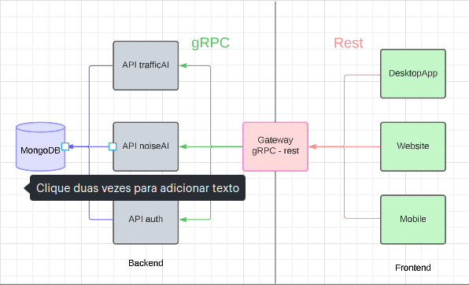

<h1> AcusticAIApi </h1>

  

<h2> Shortcuts </h2>
<a href="#article">- Article</a>
<h3 id="article"> Article </h3>

  
This article and repository has the propose of give a desktop app that contains 3 principle features: one api for counting veicules and classifying them from videos and images, another api to predict the noise with the variables that contains the other api offers and finally salving all the data from the user in the Database ( MongoDB ).

  <a href=""> Link to article in ( PT-BR ) - original.</a>
   
  <a href=""> Link to article in ( ENG ).</a>

